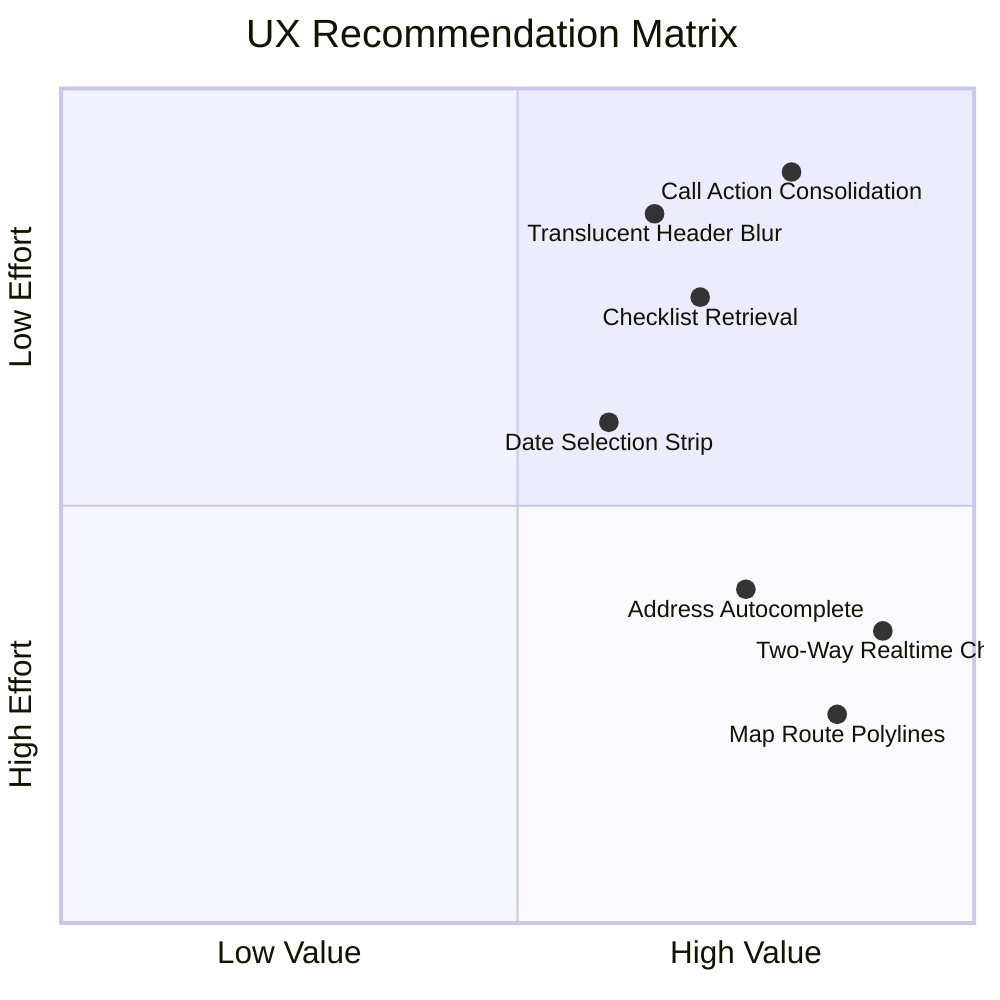

# Mobile X-Ray Client Portal — Professional UX Evaluation & Recommendations
*Empathetic, Consumer-Grade Design for Patients and Caregivers*

This document provides a professional UX/UI design evaluation of the mobile-first Client Portal (`/client` and `/client/request`). It outlines what is currently working, identifies visual and cognitive friction points, and recommends specific enhancements to elevate the system to a world-class consumer health experience.

---

## 1. UX Posture & Target Personas

The primary user of the client portal is a **patient** or **on-site caregiver** (such as an anxious family member or a busy nursing facility coordinator).

### 1.1 Cognitive Profile of our Users:
*   **High Anxiety:** Waiting for medical imaging is inherently stressful.
*   **Urgency & Focus:** Users are searching for single answers: *"Where is the technician?"*, *"When will my doctor see the results?"*, and *"How do I prepare?"*
*   **Device Context:** Mobile-first, often viewed one-handed on a phone while attending to a patient or waiting at home.
*   **Accessibility Constraints:** Users may include elderly patients with minor visual impairments, meaning high-contrast typography, large touch targets, and low cognitive load are absolute requirements.

---

## 2. Comprehensive UX Audit (Heuristic Analysis)

We evaluated the current implementation across five core dimensions of UX design.

### 2.1 Visual Design & Aesthetics ("Liquid Glass" Theme)
*   **The Wins:** 
    *   The dynamic gradient **Hero Cards** (shifting between deep clinical navy, medical blue, calm amber, and reassurance green) establish a strong visual anchor that instantly communicates visit status without reading small print.
    *   Soft iOS-style curves (`rounded-proto-xl` / `26px` and `rounded-proto-lg` / `20px`) feel human, soft, and premium, avoiding the boxy, sterile look of traditional medical software.
    *   Subtle multilayer shadows (`shadow-proto-pop`) give a beautiful sense of depth that lifts cards from the slate-gray background.
*   **Opportunities for Improvement:**
    *   **AppBar Rigidity:** The top navigation bar is currently flat. Incorporating a translucent backdrop blur filter (`backdrop-filter: blur(16px) bg-white/70 border-b border-white/20`) would bring the app closer to the premium Liquid Glass standard.
    *   **Micro-Animations:** The state transitions (e.g. from en-route to in-progress) are instantaneous. Introducing smooth React Spring or CSS transitions for status-card swaps would make the portal feel alive and cohesive.

### 2.2 Cognitive Load & Visual Noise
*   **The Wins:**
    *   The vertical status stepper is clear, clean, and maps perfectly to backend states. The completed items change to reassurance green, which builds confidence.
    *   The **Contextual Prep Checklist** only appears when an appointment is confirmed (`assigned`), preventing information overload during the scheduling or waiting phases.
*   **Opportunities for Improvement:**
    *   **Call Action Redundancy:** There are currently **four** separate entry points to "Call Care Coordinator" on a single screen:
        1. A full-width button inside the help card.
        2. A persistent sticky FAB (Floating Action Button) in the bottom-right corner.
        3. An inline link at the bottom of the intake form.
        4. Secondary buttons on empty states.
        *UX Recommendation:* Remove the persistent FAB when an active order is in the `en-route` or `in-progress` phase, as it overlaps visual tracking elements on mobile screens. Consolidate contact triggers into a single, clean "Support" action in the tab bar or within the active appointment card.

### 2.3 Interaction Design & Telemetry Map
*   **The Wins:**
    *   The Leaflet map dynamically tracks and displays the technician's coordinate telemetry.
    *   Calculating ETA using the geodetic **Haversine formula** (assuming 25 mph) provides real-time transparency rather than hardcoded estimations.
    *   The access note input simulates a real-time messaging window by rendering submitted comments as active chat bubbles.
*   **Opportunities for Improvement:**
    *   **One-Way Messaging Friction:** The chat bubbles are beautiful, but they currently only show a one-way stream (what the patient sent). If a technician or dispatcher responds, the patient does not see it inside the bubble thread. 
        *UX Recommendation:* Expand the access message card to subscribe to the order's message channel in real-time, displaying a true two-way dialogue between the caregiver and the responding technician.
    *   **Static Map Routes:** The map shows two static pins (technician and patient facility).
        *UX Recommendation:* Draw a dynamic routing polyline (travel path) between the two coordinates. Seeing the path makes tracking feel intuitive and resembles consumer apps like Uber or DoorDash.

### 2.4 Intake & Request Form (`/client/request`)
*   **The Wins:**
    *   Grouping fields into clean, thematic cards (Details, Location, Procedure, Schedule, Access) reduces form-completion fatigue.
    *   Pre-filling the patient's name using session state saves time and minimizes typos.
    *   Preferred time slot selectors are large, touch-friendly cards instead of a crowded radio-button list.
*   **Opportunities for Improvement:**
    *   **Address Friction:** Manually typing street addresses on mobile keyboards is prone to typos.
        *UX Recommendation:* Implement Google Places Autocomplete or an address validation API. This guarantees coordinate correctness for dispatcher mapping and eliminates patient typing errors.
    *   **Native Date Picker Barriers:** The "Preferred Date" uses a standard HTML `<input type="date">` wrapper, which has inconsistent sizing and visual rendering across older mobile browsers.
        *UX Recommendation:* Integrate a custom slider/date-strip selector showing the next 7 days in a horizontal scrollable row, making scheduling a single-tap action.

---

## 3. Prioritized Recommendation Matrix

Below is a roadmap of recommended UX changes, ranked by feasibility, value, and developmental effort.

### 3.1 Quick Wins (Low Effort, High Value)
1.  **Call Action Consolidation:** Remove the sticky blue FAB when the status is `en-route` or `in-progress` to prevent card overlapping on small screens. Ensure the coordinator number is present in a single, high-contrast block.
2.  **Translucent Header Glassmorphism:** Add backdrop blur styling to the root client layout template, creating a sleek iOS system-bar feel.
3.  **Checklist Retrieval Pattern:** Once the patient dismisses the Prep Checklist card, add a small, clickable link inside the Appointment Card: *"Show Prep Instructions"* so they can retrieve it at any time.

### 3.2 Medium Term Enhancements (Medium Effort, High Value)
1.  **Horizontal Date Selection Strip:** Replace the standard date picker input with a scrollable card row containing the next 7 days (e.g., `Mon Jun 1`, `Tue Jun 2`). This decreases touch friction and prevents keyboard overlay bugs.
2.  **Address Autocomplete Integration:** Hook up a lightweight geographical search provider to the address form.
3.  **True Two-Way Realtime Messaging:** Wire the message bubble stream to fetch and render incoming messages where `sender_role: "dispatcher"` or `sender_role: "technician"` inside the specific order channel.

### 3.3 Premium Leap Features (High Effort, Extremely High Value)
1.  **Dynamic Map Travel Routes:** Feed the current technician coordinate and patient coordinate into an open-source router engine (like OSRM) and render a custom travel polyline overlay on the Leaflet map. This visually answers the patient's question *"Where is my tech?"* in one second.
2.  **Visit Success Summary & Rating:** After Step 5 ("Scan Complete") is completed, present the patient with a review star rating and comments field to collect direct caregiver feedback, improving service tracking.
